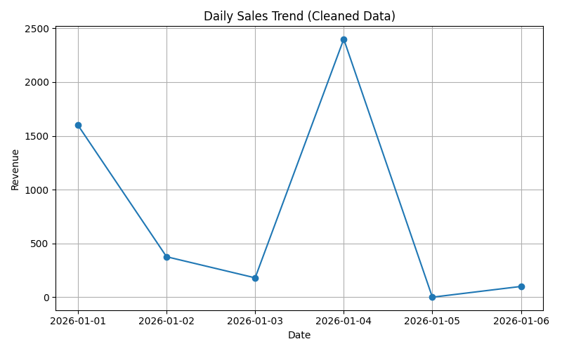
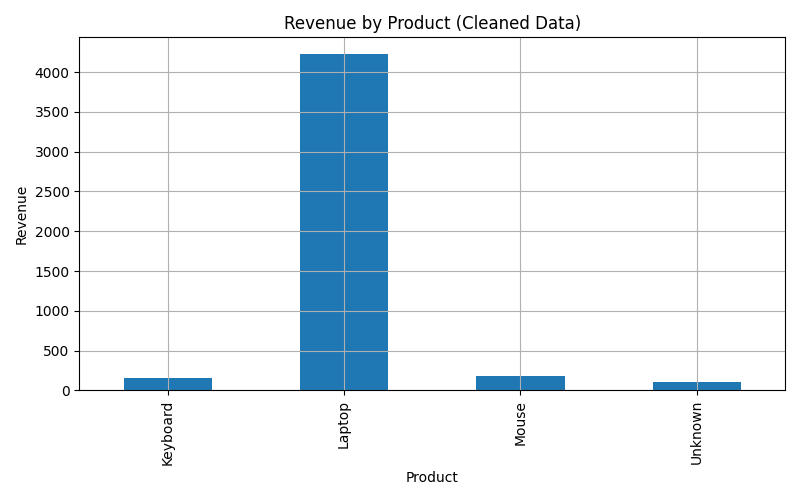
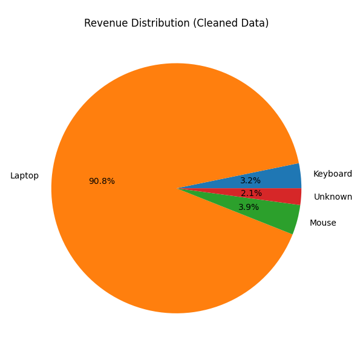

# 📊 Real-World Data Analysis (Messy Data)

## Overview
This project demonstrates cleaning and analyzing messy real-world data using Python.

## Key Features
- Handled missing and invalid values
- Converted incorrect data types
- Generated revenue insights
- Created visualizations

## Key Insights
- Laptop generates majority of revenue
- Missing data affects analysis results
- Data quality issues create 'Unknown' categories

## Visualizations

## Author
Saud Khan — Thinking Beyond the Universe
